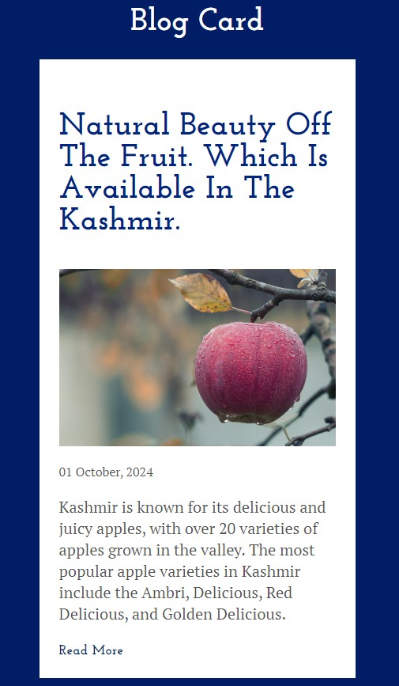

## Blog Design🎯

</ul><h2> Preview ⚡️</h2>
<p align="center">
  
</p>

## Technologies used 🛠️

**Markup**: HTML <br />
**Design**: CSS <br />

## Usage 📋

<details open>
<summary> Here it is used to design the Blog Card Post </summary>

```bash
#1. clone this project
~ git clone https://github.com/ashishthomas/

#2. Open the index.html file in your browser
~ open index.html

#3. To display the clock in your browser
~ live server

#4. Enjoy!

```

</details>

## Disclamer ❗️

I am simply an Employee passionate about Front-end and the intersection of code and design, I always try to do courses and projects during my free time, so I can learn more and more. I am always open to suggestions and feedback.

## Contributing 💡

Pull request are welcome but please open an issue and discuss what you will do before 😊

## Author ✒️

**Ashish Sunil Thomas**

## Like this project? 💖

Give a ⭐️ if you like this project!
